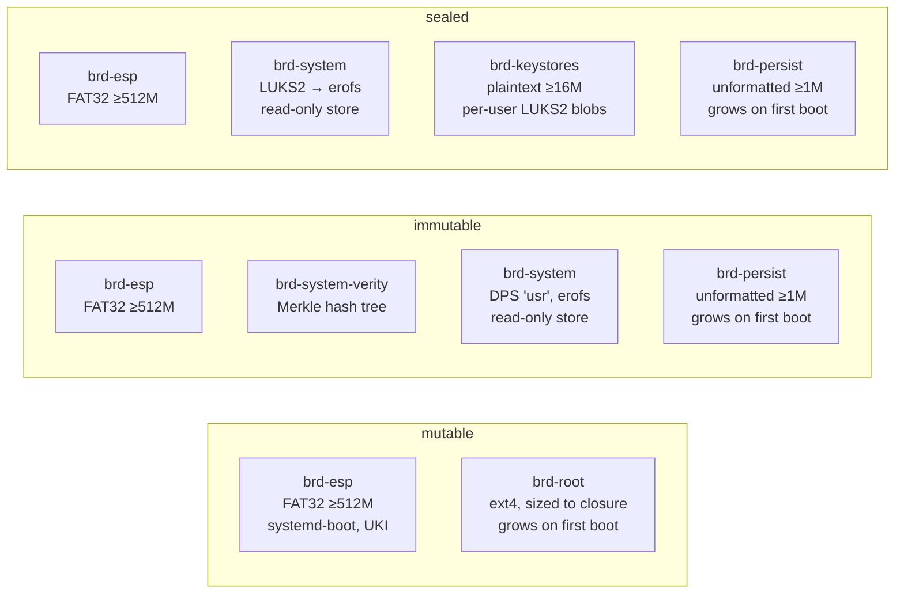

# nixos-hosts

Declarative NixOS system configurations — a development WSL host and, more interestingly, **brdboot**: a portable, cryptographically-verified recovery and diagnostics image in four flavors.

## brdboot

**Bootable Recovery & Diagnostics.** Flash a USB stick, boot on any x86_64 machine, and get a full NixOS environment tuned for incident response, forensic work, and field deployments. Four variants trade off between convenience and integrity:

| Variant | Best for | Writable? | Verified? | Encrypted? |
|---|---|---|---|---|
| **`ephemeral`** | one-shot live sessions (ISO) | tmpfs overlay only | squashfs checksum | — |
| **`mutable`** | dev / debug / flexible workflows | yes (ext4, auto-grows) | — | — |
| **`immutable`** | trusted recovery where tamper detection matters | read-only store + writable persist | **dm-verity** | — |
| **`sealed`** | secrecy + eventually integrity (proprietary fleet) | read-only store + writable persist | *planned* | **LUKS2** |

All four share a common filename pattern — `brdboot-<variant>-<label>-<system>-<version>.{raw,iso}` — and a unified boot envelope (UKI + systemd-boot on an ESP, systemd-repart-driven partition growth at first boot).

### Boot chain

```mermaid
flowchart TD
    A[UEFI firmware] --> B[systemd-boot<br/>/EFI/BOOT/BOOTX64.EFI]
    B --> C[UKI<br/>/EFI/Linux/*.efi]
    C --> D{initrd: variant-specific<br/>root activation}
    D -->|ephemeral| E1[squashfs → tmpfs overlay]
    D -->|mutable| E2[ext4 mount<br/>from by-partlabel/brd-root]
    D -->|immutable| E3[dm-verity activates<br/>/usr from verified erofs<br/>/nix/store bind-mounts from /usr/nix/store]
    D -->|sealed| E4[LUKS prompt → erofs mount<br/>at /nix/store]
    E1 --> F[pivot to real root]
    E2 --> F
    E3 --> F
    E4 --> F
    F --> G[systemd boot to multi-user.target]
    G --> H[getty@tty1 + PAM]
    H --> I[homed: unlock user's<br/>LUKS home container<br/>via PAM_AUTHTOK]
    I --> J[user session]
```

The **immutable** variant's integrity comes from dm-verity: the UKI cmdline carries a SHA-256 root hash over the `/usr` erofs partition. The kernel rejects any read that doesn't match the Merkle tree in the paired hash partition. Tamper with the flashed drive and it refuses to boot.

### Stages in plain terms

If you know vaguely what a boot chain is but haven't spent time inside an initrd, here's each stage:

**UEFI firmware.** The modern replacement for the legacy PC BIOS. It's software built into your motherboard that runs the moment you power on, checks that an EFI-bootable drive is present, and loads the first stage of any operating system it finds there.

**systemd-boot.** A small bootloader (similar in role to GRUB) that sits in the first FAT32 partition of the USB (the ESP). It reads a list of kernels and offers a menu — on brdboot this menu is auto-skipped and the default kernel loads immediately.

**UKI — Unified Kernel Image.** A single EFI file that bundles the Linux kernel, the initial ramdisk, and the kernel command line into one blob. The same technology lets phones and Chromebooks ship signed, unforgeable boot bundles: because everything is in one file, the signature covers not just the kernel but also the exact arguments it will boot with (including the dm-verity root hash on immutable).

**initrd — the initial ramdisk.** A compact temporary operating system that lives in RAM, extracted from the UKI at boot. Its only job is to prepare the real root filesystem — loading storage drivers, prompting for disk passphrases, activating dm-verity, decrypting LUKS volumes. Once ready, it "pivots" (pivot-root) into the real filesystem and exits. Think of it as a scaffolding crew that builds the access path to the real building and then leaves.

**dm-verity.** A kernel mechanism that verifies every read from a block device against a cryptographic Merkle tree (a tree of hashes). The single "root hash" at the top of the tree is baked into the UKI's command line; the tree itself lives on its own partition. If even one byte on disk doesn't match, the kernel returns an I/O error. This is the same idea your phone uses to guarantee the OS image hasn't been tampered with — Android and iOS both ship a dm-verity-like layer under the system partition, and it's what makes "offline drive modification" detection reliable without a Secure Boot chain.

**LUKS (Linux Unified Key Setup).** Disk encryption. A LUKS header sits at the start of a partition and wraps the real encryption key in one or more keyslots, each unlockable with a different passphrase. This is the same class of technology as Apple's Data Protection on iOS or BitLocker on Windows — data at rest is meaningless without the key, and you can add/remove keys without re-encrypting everything.

**systemd-homed.** Manages per-user home directories as portable LUKS-encrypted containers. Each user's home is an image file (`/home/<user>.home`) that's decrypted with their login password and mounted only while they're logged in. Logging out re-locks it. On multi-user systems this gives per-user encryption without needing whole-disk encryption for every user.

**PAM — Pluggable Authentication Modules.** The standard Unix mechanism for authenticating users. Login programs (`login`, `sshd`, `su`) don't implement password checking themselves; they call into a stack of PAM modules, each of which can approve, deny, or pass to the next. On brdboot, our custom `pam_brdboot_credential.so` fits at the top of the stack: it reads credentials staged by the initrd and short-circuits the login flow when they're present, so one password at boot can flow all the way through to a logged-in session.

### Partition layouts

**ephemeral** uses an ISO9660 filesystem with hybrid boot (BIOS via isohdpfx, UEFI via GPT-embedded ESP). The other three are GPT:



The ESP, `brd-persist`, and the verity partitions are sized tightly — the built images don't pad with zeros. `systemd-repart` handles all GPT authoring; runtime growth is via its systemd service, not the legacy `boot.growPartition`.

### Feature modules

Optional, all under `brdboot.*`. Several are staged infrastructure for an upcoming **single-prompt boot chain** where one password at the initrd cascades through per-user keystore unlock → system LUKS unlock → dm-verity activation → pivot → PAM auto-login → homed home-unlock.

| Option | What it enables | Default |
|---|---|---|
| `brdboot.homed.enable` | `systemd-homed` — per-user LUKS home containers keyed on login password | **`true`** (debug-friendly; override in production profiles) |
| `brdboot.singlePrompt.enable` | Initrd service: prompt user+password, try keystore-based LUKS unlock, always stage credentials for post-pivot PAM | `false` |
| `brdboot.singlePrompt.autoLogin` | Stack a custom PAM module + getty wrapper that complete login from the staged credentials | `false` |

### Build

```bash
# ephemeral / mutable / sealed:
nix build .#nixosConfigurations.brdboot.config.system.build.images.<variant>

# immutable (three-stage pipeline — expose the bootable finalImage):
nix build .#nixosConfigurations.brdboot.config.system.build.images.immutable.passthru.config.system.build.finalImage
```

### Flash

```bash
# raw GPT images
sudo dd if=result*/*.raw of=/dev/sdX bs=4M status=progress conv=fsync

# ephemeral ISO (hybrid)
sudo dd if=result/iso/*.iso of=/dev/sdX bs=4M status=progress conv=fsync
```

Windows: [Rufus](https://rufus.ie) in DD mode for either.

### Provisioning

**`sealed`** ships with a LUKS volume keyed to a random, discarded build-time key. Before handing the drive to an end user, re-key:

```bash
# after flashing, before first boot:
sudo cryptsetup luksFormat /dev/sdX2
```

The subsequent passphrase prompt captures the real operator/customer secret. The erofs contents survive — only the LUKS keyslot is replaced.

`brd-keystores` is reserved for per-user `<user>.keystore` LUKS2 blobs that a follow-up PR populates: each user's password unlocks a tiny keystore that holds the shared deployment key for `brd-system`. The partition is plaintext at the block level — only the list of enrolled usernames is exposed; the deployment key stays behind each keystore's LUKS envelope. Revocation is deleting a keystore file; other users keep working.

### First-boot UX

With `brdboot.homed.enable = true` (the current default), each user gets a LUKS-encrypted home container created on demand. There's a known caveat: NixOS's default `ids.uids.nixbld = 30000` places the `nixbld*` build users above UID 1000, so `systemd-userdb` treats them as regular users and `homectl firstboot` skips the interactive account prompt it would otherwise run. The userdb warning is silenced; the behavioral gap remains.

Workaround for now — after first boot, from the root shell:

```bash
sudo homectl create alice --storage=luks --fs-type=btrfs
```

A follow-up PR will address this (either by lowering `nixbld` UIDs or disabling build users entirely on the recovery image).

### Continuous integration

GitHub Actions builds all four x86_64 variants plus `aarch64` ephemeral on every PR push. Composite actions under `.github/actions/` handle Nix installation, derivation-hash-based artifact deduplication, and binary cache export — a fresh PR with no store changes lands in under a minute.

## References

- [NixOS Discoverable Partition Specification module](https://uapi-group.org/specifications/specs/discoverable_partitions_specification/)
- [systemd-repart(8) + repart.d(5)](https://www.freedesktop.org/software/systemd/man/systemd-repart.html)
- [dm-verity kernel docs](https://www.kernel.org/doc/html/latest/admin-guide/device-mapper/verity.html)
- [systemd-homed(8)](https://www.freedesktop.org/software/systemd/man/systemd-homed.html)
